# DO2_LINUXNETWORK-1

## Part_1: Ipcalc

### 1.1. Сети и маски

1. __Адрес сети 192.167.38.54/13 = 192.160.0.0/13__

2. __Перевод маски 255.255.255.0__
   - Префиксная запись: /24
   - Двоичная запись: 11111111.11111111.11111111. 00000000
   - __Перевод маски: /15__
   - Обычная запись: 255.254.0.0
   - Двоичная запись: 11111111.11111110.00000000. 00000000
   - __Перевод маски: 11111111.11111111.11111111.11110000__
   - Обычная запись: 255.255.255.240
   - префиксная запись: /28
3. __Cеть 12.167.38.4/8__
   - HostMin:   12.0.0.1
   - HostMax:   12.255.255.254
   - __Cеть 12.167.38.4/11111111.11111111.00000000.00000000(/16)__
   - HostMin:   12.167.0.1
   - HostMax:   12.167.255.254
   - __Cеть 12.167.38.4/255.255.254.0__
   - HostMin:   12.167.38.1
   - HostMax:   12.167.39.254
   - __Cеть 12.167.38.4/4__
   - HostMin:   0.0.0.1
   - HostMax: 15.255.255.254

### Part_1.2: Localhost

- У меня получилось пропинговать только два адреса: 127.0.0.2, 127.1.0.1. Они пренадлежат локальному сетевому интерфейсу, который работает только в приделах одной системы. Он назвается "LOOPBACK". Остальные адреса не пренадлежат к сети localhost.

### Part_1.3: Network segments and ranges(Диапазоны и сигменты сетей)

- __Диапозоны частных ip-адресов__

  - *10.0.0.0 – 10.255.255.255* (диапазон *10.0.0.0/8*) — большой диапазон для крупных сетей.

  - *172.16.0.0 – 172.31.255.255* (диапазон *172.16.0.0/12*) — средний диапазон для сетей среднего размера.

  - *192.168.0.0 – 192.168.255.255* (диапазон *192.168.0.0/16*) — самый популярный диапазон для домашних и небольших сетей.

1. - Использовать в качестве __частных IP__ можно: *10.0.0.45, 192.168.4.2, 172.20.250.4, 172.16.255.255, 10.10.10.10*
   - Использовать в качестве __публичных IP__ можно: *134.43.0.2, 172.0.2.1, 192.172.0.1, 172.68.0.2, 192.169.168.1*

2. Для сети 10.10.0.0/18 возможны следующие ip-адреса шлюзов(gateway): *10.10.0.2, 10.10.10.10, 10.10.1.255*

---

## Part_2: Static routing between two hosts

- 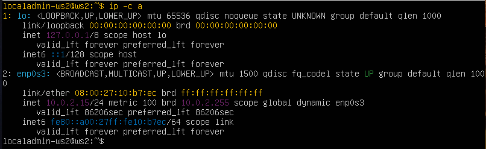 Сетевой интерфейс первой машины(ws1)
- 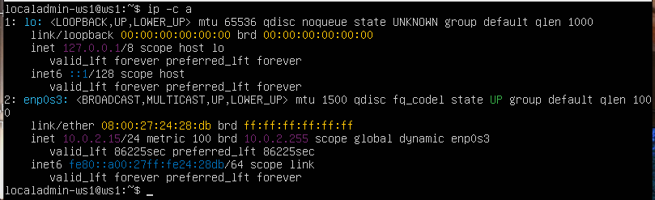 Сетевой интерфейс второй машины(ws2)

__Сетевой интерфес ws1__:

- Имя интерфейса __enp0s3__. Это название указывает на проводное интернет соединение, которое эмулирует VirtualBox.
  - __BROADCAST__: Означает, что интерфейс может отправлять сообщения всем в сети.
  - __MULTICAST__: Означает, что интерфейс может отправлять сообщения группе устройств одновременно.
  - __UP__: Означает, что интерфейс включен и готов к работе.
  - __LOWER_UP__: Означает, что интерфейс работает на физическом уровне.
  - __mtu 1500__: Это *Maximum Transmission Unit* — максимальный размер пакета, который может отправить интерфейс за одну передачу (обычно 1500 байт).
  - __qdisc__ (queueing discipline) - Это механизм в ядре Linux, который определяет, как пакеты данных ставятся в очередь перед отправкой через сетевой интерфейс.
  - __fq_codel__ (Fair Queueing with Controlled Delay) - Это конкретная дисциплина очереди, разработанная для борьбы с проблемами буферизации (bufferbloat) и обеспечения справедливого распределения пропускной способности между различными потоками данных.
    - __Fair Queueing__ (Справедливое распределение): fq_codel пытается обеспечить, чтобы ни один поток не монополизировал канал связи, обеспечивая тем самым более равный доступ к сети для разных пользователей и приложений.
    - __Controlled Delay__ (Контролируемая задержка): fq_codel активно управляет длиной очереди, чтобы минимизировать задержки и обеспечить отзывчивость сети.
  - __state UP__ - Еще одно подтверждение того, что интерфейс активен.
  - __group default__ - Интерфейс находится в группе по умолчанию.
  - __qlen 1000__ - Это максимальный размер очереди, перед отправкой.
  - __link/ether__: Указывает, что это Ethernet-интерфейс (протокол, по которому общаются устройства в сети). Использует Ethernet-подобные механизмы.
  - __08:00:27:24:28:db__ - Это *MAC-адрес* сетевого интерфеса. Он уникальный для каждого устройства.
  - __brd ff:ff:ff:ff:ff:ff__ - Это *широковещательный MAC-адрес*.
  - __inet__: Указывает, что это *IPv4-адрес*
  - __192.168.100.10__: Это IP-адрес компьютера в сети.
  - __/16__: Это маска подсети.
  - __brd__(broadcast) __10.1.30.255__: Это *широковещательный IP-адрес*
  - __scope global__: Означает, что IP-адрес действителен в глобальной сети.
  - __valid_lft__ и __preferred_lft__: Это время жизни (lease) IP-адреса.  В данном случае, он действителен и предпочтителен вечно(forever).
  - __inet6__: Указывает, что это *IPv6-адрес*.
  - __fe80::a00:27ff:fe24:28db/64__: Это *IPv6-адрес* компьютера.
  - __scope link__: Означает, что IPv6-адрес действителен только в пределах локальной сети.

__Сетевой интерфейс ws2__:

- Имя интерфейса __enp0s3__. Это название указывает на проводное интернет соединение, которое эмулирует VirtualBox.
  - Mac-адрес: *08:00:27:10:b7:ec*
  - Широковещательный Mac-адрес: *ff:ff:ff:ff:ff:ff*
  - IPv4-адрес: *172.24.116.8*
  - Маска сети: */12*
  - Широковещательный IP-адрес: *172.31.255.255*
  - IPv4-Адрес, выдан навсегда
  - IPv6-Адрес: *fe80::a00:27ff:fe10:b7ec/64*
  - IPv6-Адрес, выдан навсегда

- ") Новый статический ip-адрес пк(ws1)
- ") Новый статический ip-адрес пк(ws2)

- ") Обновление настроек сетевого интерфейса(ws1)
- ") Обновление настроек сетевого интерфейса(ws2)

### 2.1. Добавление статического маршрута вручную

- ") Добовление нового статического маршрута и его пропинговка(ws1)
- ") Добовление нового статического маршрута и его пропинговка(ws2)

### 2.2. Добавление статического маршрута с сохранением

- ") Добовление нового статического маршрута и его пропинговка, а так же его сохранение навсегда(ws1)
- ") Добовление нового статического маршрута и его пропинговка, а так же его сохранение навсегда(ws2)

- ") Пропинговка нового постояннного маршрута(ws1)
- ") Пропинговка нового постоянного маршрута(ws2)

---

## Part_3: Utility iperf3

### 3.1. Скорость соединения

>1 Mbps == 0.125 MB/s

- 8 Mbps == 1 MB/s
- 100 MB/s == 800000 Kbps
- 1 Gbps == 1000 Mbps

### 3.2. Утилита iperf3

- ") Тест скорости соеденения между ws1(сервер) и ws2(клиент) - ws1
- ") Тест скорости соеденения между ws1(сервер) и ws2(клиент) - ws2

---

## Part_4: firewall (Сетевой экран, брандмауэр)

__4.1. Утилита iptables__:

- ") Конфигурация правил для сетевого экрана машины ws1
- ") Конфигурация правил для сетевого экрана машины ws2

- ") Запуск конфигурации правил для сетевого экрана машины ws1
- ") Запуск конфигурации правил для сетевого экрана машины ws2

- >iptables обрабатывает правила последовательно, сверху вниз, и прекращает
  проверку после нахождения первого подходящего правила. В iptables существуют терминальные и нетерминальные действия. Когда пакет встречает терминальное действие, он покидает цепочку. Основные терминальные дейтсвия - это ACCEPT, DROP, REJECT. Так же лучше ставить частные правила выше более общих. Поэтому машина ws1 не пропинговывается, так как правило с запретом этого действия прописано выше правила с разрешением пропинговки.

__4.2. Утилита nmap__:

- ") Проверка соедениния с помощью команды nmap между ws2 и ws1(ws2)

---

## Part_5: Static route network

__5.1. Setting up machine addresses__:

- ") Статическая настройка IP-адресов для машины ws11
- ") Статическая настройка IP-адресов для машины ws21
- ") Статическая настройка IP-адресов для машины ws22
- ") Статическая настройка IP-адресов для машины r1
- ") Статическая настройка IP-адресов для машины r2

- ") Перезапуск, вывод нового IP и пропинговка r1 c ws11 (r1)
- ") Перезапуск, вывод нового IP и пропинговка ws22 c ws21 (ws21)
- ") Перезапуск, и проверка новых настроек ip(ws22)
- ") Перезапуск, и проверка новых настроек ip(ws11)
- ") Перезапуск, и проверка новых настроек ip(r2)

__5.2. Enabling IP forwarding(Включение переодрисации IP-адресов)__:

- ") Временное разрешение пересылки пакетов между двумя интерфейсами (r1)
- ") Временное разрешение пересылки пакетов между двумя интерфейсами (r2)

- ") Постоянное разрешение пересылки пакетов между двумя интерфейсами (r1)
- ") Постоянное разрешение пересылки пакетов между двумя интерфейсами (r2)

__5.3.Setting the default route__:

- ") Установка gateway по-умолчанию для машины ws11(В данном случае это делается по новым правилам netplan)
- ") Установка gateway по-умолчанию для машины ws21(В данном случае это делается по новым правилам netplan)
- ") Установка gateway по-умолчанию для машины ws22(В данном случае это делается по новым правилам netplan)

- ") Вывод всех маршрутов в машине ws11
- ") Вывод всех маршрутов в машине ws21
- ") Вывод всех маршрутов в машине ws22

- ") Пропинговка r2 c ws11 (ws11)
- ") Прослушивание пинга приходящего с ws11(r2)

__5.4.Adding static routes__:

- ") Добовление маршрута между двумя локальными сетями(r1)
- ") Добовление маршрута между двумя локальными сетями(r2)

- ") Вывод таблицы маршрутизации(r1)
- ") Вывод таблицы маршрутизации(r2)

- ") Вывод определённых маршрутов(ws11)

- > Когда система получает команду отправки пакета данных, она сравнивает маски сетей, которые указаны в таблице маршрутизации, если сущетвует два подходящих маршрута, то программа выберет тот маршрут, который будет иметь наибольший битовый IP-адрес(10.10.0.0 */18* или 0.0.0.0 */0*). Это называется Longest prefix match.

__5.5. Building a list of routes__:

- ") Прослушивание сигналов(r1) tcpdump
- ") Иследование маршрута от машины ws11 до ws21(ws11) traceroute

- > Утилита traceroute отправляет пакет с параметром TTL, который определяет время жизни пакета. Это значит,что если TTL=1, пакет, дойдёт до первого маршрутизатора, и вернется обратно с информацией о этом маршрутизаторе. Далее после возвращения пакета на главное host-устройство, параметр TTL становиться равен 2 и имеет возможность пройти уже два маршрутизатора между точками назначения. Если он доходит, до второго маршрутизатора и это оказывается не пункт назначения, он так же возвращается обратно, принося с собой данные об втором маршрутизаторе. Все это повторяется до того момента, пока пакет не достигнет устройства с адресом назначения.

__5.6. Usening ICMP protocol at routes__:

- ") Перехват сетевого трафика(r1) tcpdump
- ") Пропинговка несущетвующего ip(ws11)

---

## Part_6: DHCP

- 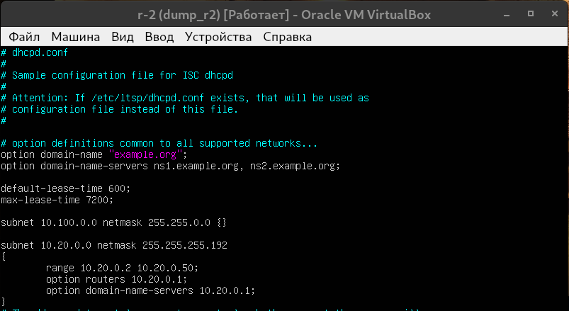 Настройка конфигурации для dhcp сервера(r2)
- 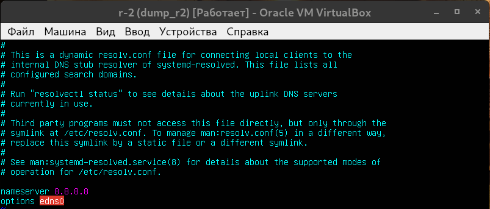 Изменение dns-сервера(r2)
- 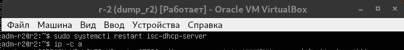 Перезагрузка dhcp-сервера(r2)
- 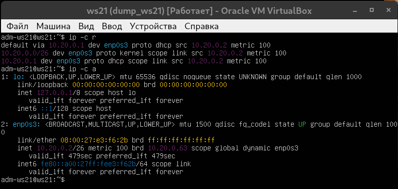 Вывод нового ip, полученного от dhcp сервера на r2 (ws21)
- 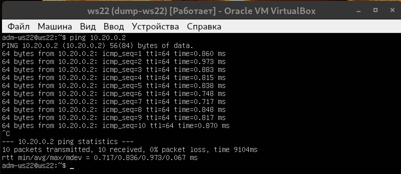 Пропинговка ws21 по новому ip(ws22)

- 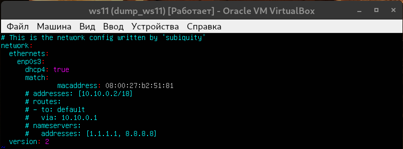 Включение динамической адресации и связование конфигурации настроек с mac-адресом сетевого интерфейса(ws11)

- 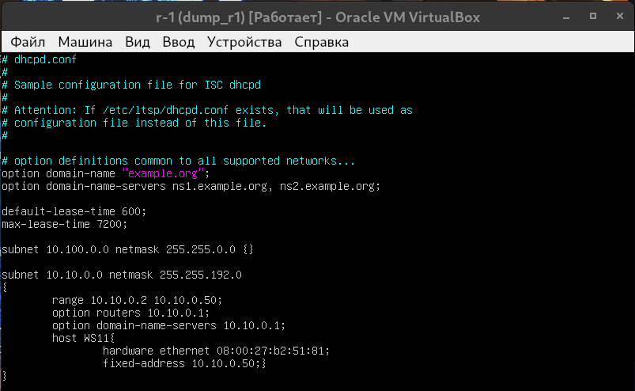 Настройка конфигурации для dhcp сервера с привязкой ip к опредёлённому интерфейсу с помощью mac-address(r1)
- 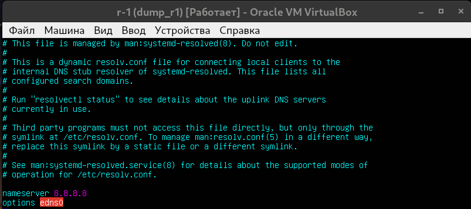 Изменение dns-сервера(r1)
- 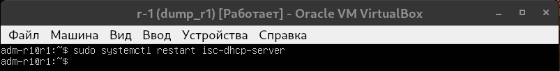 Перезагрузка dhcp-сервера(r1)
- 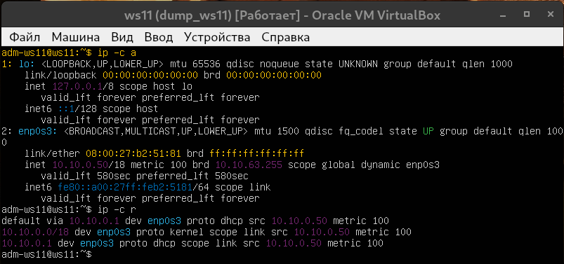 Вывод нового ip, полученного от dhcp сервера на r2 (ws11)
- 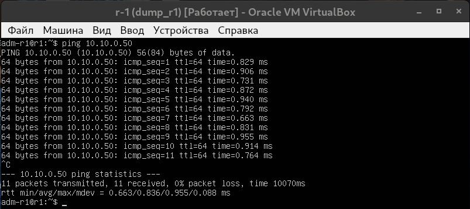 Пропинговка ws11 по новому ip(r1)

- 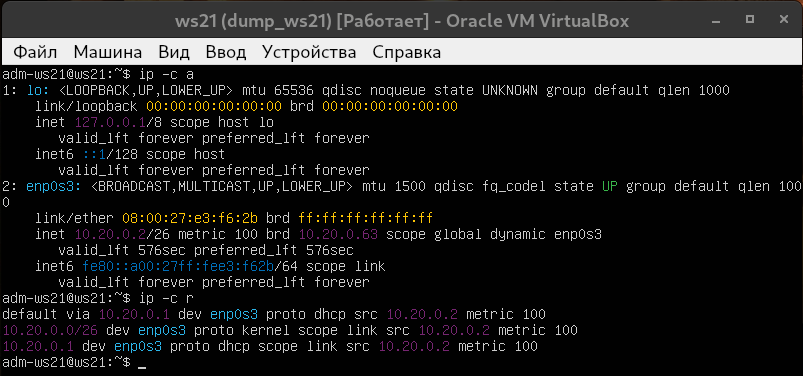 Изначальный ip(ws21)
- 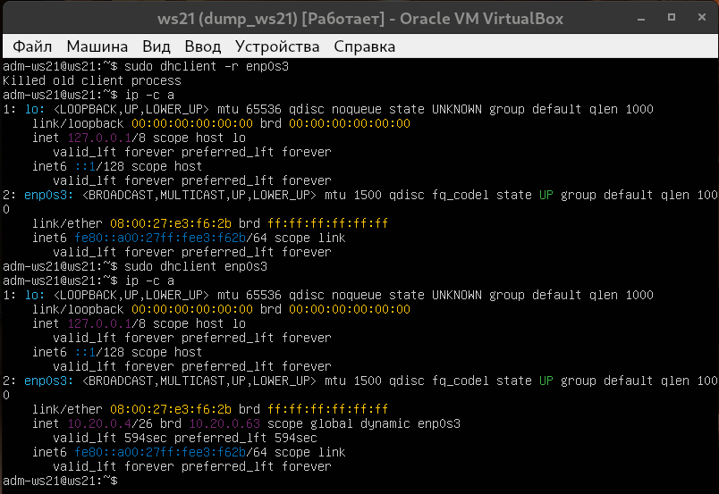 Запрос нового ip у dhcp-сервера(ws21)

- Настраивая dhcp-сервер я использовал для настроек:
  - Маска подсети: Option 1;
  - Основной шлюз: Option 3;
  - Адрес сервера DNS: Option 6;

---

## Part_7: NAT

- 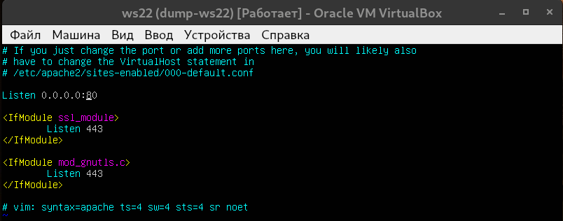 Открытие доступа к веб-серверу(ws22)
- 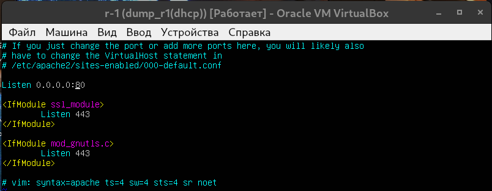 Открытие доступа к веб-серверу(r1)

- 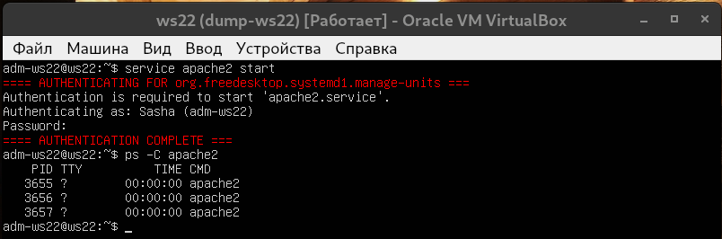 Включение веб-сервера(ws22)
- 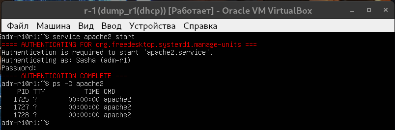 Включение веб-сервера(r1)

- 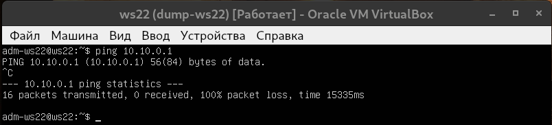 Отсутсвие соединения между ws22 и r1 (ws22)
- 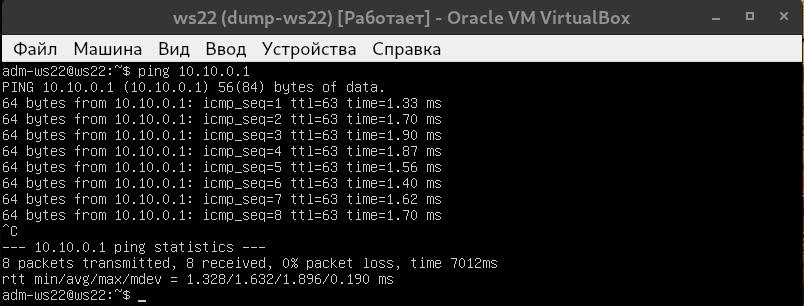 Сервера r1 и ws22 пингуются(ws22)

- 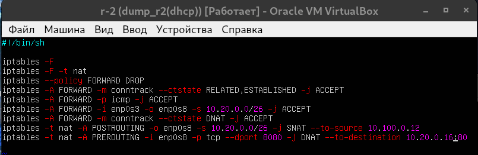 Правила обработки трафика /etc/firewall.sh(r1)

- 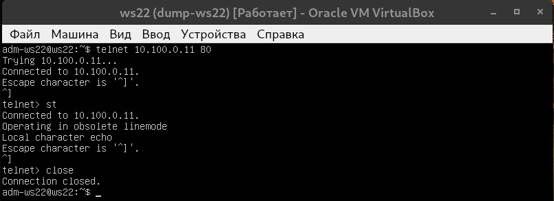 Проверка соединения с веб-сервером на машине r1, по внешнему адресу(ws22)
- 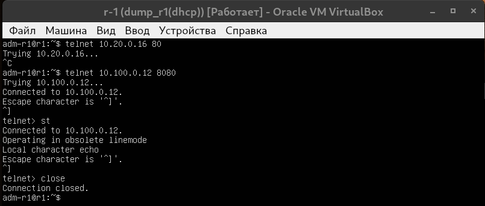 Проверка соединения с веб-сервером на машине ws22, по внешнему адресу с помощью DNAT(r1)

---

## Part_8: SSH Tunnels
